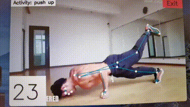
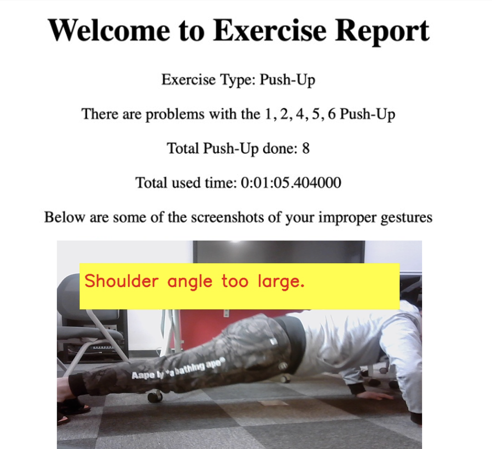

# AI gym robot for exercise guidance

This is the code for the pose evaluation part of the project **Robot for gym exercise guidance** in ECE445 senior design.

## Overview
People are increasingly turning to exercise to improve their health and well-being. However, many individuals are unaware of the correct techniques for performing exercises, which can lead to injuries and other health issues. Though it is possible to hire a personal trainer to provide guidance, the expense is often prohibitively high.

This project tends to develop a robot to provide exercise guidance in a gym setting, monitoring the repititions of movements and generate feedback for incorrect movements.

## Features

- Support two exercise types (squat and push-up)
- Count the repetitions of the exercise at runtime
- Generate a detailed report after the user finishes exercising, including:
  - Screenshots of the incorrect movements with feedback
  - The elapsed time of exercising
  - The total number of repetitions

## How to run
Install the required packages in `requirements.txt` via `pip`. Then run with `python main.py -t <exercise-type>`, where the exercise type is either "squat" or "push-up".

Alternatively, if you want to run the program on a local video file instead of using your camera, add another flag `-vs` with the path to your video file (i.e. `python main.py -t <exercise-type> -vs <path-to-your-video-file>`.

## Examples
### Movement counting
We can count various forms of push-ups:)

### Feedback generation
The program will generate a report containing the feedback. An example shown as below:

